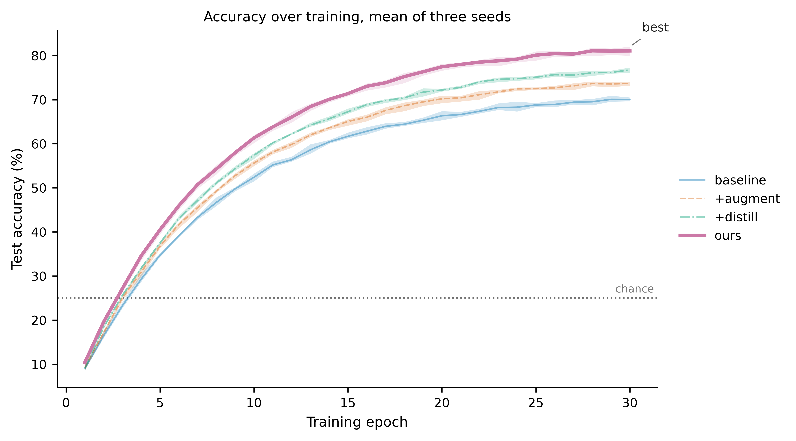

# GraphUnslopify

An MCP server that turns a JSON figure spec into matplotlib code.
Live at [json-translator-three.vercel.app](https://json-translator-three.vercel.app).


*First pass with the translation tool with JSON*

Nothing in the spec sets a colour, a line width, or a font size. The generator picks those, which is
how two figures in one paper end up agreeing with each other.


*Same JSON, after the improvements*

Adults is hatched now. The spec did not change, the tool did.

| First pass | After |
| --- | --- |
|  |  |

*Both of them printed in black and white*

This is why the hatching is there. Okabe-Ito is colourblind-safe but not greyscale-safe, so blue and
vermillion land 0.07 apart in relative luminance, under the 0.10 a reader needs. Reordering the
palette does not save it. Of all 40,320 orderings the best still leaves four series 0.094 apart.
Hatching does save it, at any number of series.



*What a spec buys you now*

Mean over three seeds with a 95% bootstrap interval, the chance line labelled where it sits, and
"best" attached to the maximum. The spec says `at: "max"`, never a pixel offset, and the script
works out where that lands because only the script has the data.

The spec behind it:

```json
{
  "kind": "line",
  "x": { "field": "epoch", "label": "Training epoch" },
  "y": { "field": "accuracy", "label": "Test accuracy", "unit": "%" },
  "group": "model",
  "aggregation": "mean",
  "uncertainty": { "kind": "ci", "level": 0.95, "over": "seed", "display": "band" },
  "series_order": ["baseline", "+augment", "+distill", "ours"],
  "emphasis": { "series": "ours" },
  "reference_lines": [{ "axis": "y", "value": 25, "meaning": "chance", "label": "chance" }],
  "annotate": [{ "at": "max", "series": "ours", "text": "best" }]
}
```

Line, scatter, bar, box, violin and heatmap. Faceting into panels, Pareto frontiers, stacked bars,
smoothing, sorting, filtering, derived values, direct labelling, and venue presets that set the
column width and font floor from the real submission guides.

## Third pass, the rest of the chart types

| | |
| --- | --- |
|  |  |
|  |  |

*Made-up coffee chain data, one chart per kind*

The data is invented, but each chart is the right choice for its question rather than a demo of the
feature. The heatmap finds the weekday commuter spike at 8am and the weekend brunch block without
being told either exists. The scatter draws the Pareto frontier. The box plot carries a target line
that says what it means, `"meaning": "target"`, and lets the generator decide how a target is drawn.

Building these found two bugs, and neither had shown up across thirty earlier figures. A scatter's
legend handle is a `PathCollection`, which has no marker to read, so four genuinely distinct marker
shapes all looked identical and the greyscale check complained about a problem the emitter had
already solved. And a colourbar is an axes, so every heatmap looked like two panels disagreeing
about their ranges.

The third finding was mine, not the tool's. It told me the legend was sitting on three data points
and suggested moving it outside, so I did.

## Writing a spec

Do not guess at the data. Ask it:

```bash
pip install ./python
graphunslopify describe results.csv
```

That reports the columns, their roles, how many distinct values each has, and whether x repeats per
series, along with a starting spec. On the example data it picks `epoch` over `seed` as the x axis
and adds the aggregation and confidence interval the repeats require.

`list_recipes` has eleven known-good specs to start from, including `training_curve`, `pareto`,
`confusion_matrix` and `faceted_curves`. `validate_spec` checks one without generating anything.

## Connecting

```bash
claude mcp add --transport http graph-unslopify https://json-translator-three.vercel.app/api/mcp
```

Your data never leaves your machine. You get back a script that reads your own CSV.

## Animation

Set `animate` and the same figure draws itself.

```json
{ "animate": { "style": "draw", "duration_s": 4, "easing": "smooth", "format": "gif" } }
```

Built on matplotlib, not manim. Manim wants cairo, ffmpeg and often LaTeX, and draws its own axes
rather than the ones this spent so long getting right. What makes those animations read well is
easing and staged construction, and both are a few lines over `FuncAnimation`. The rate functions
are ports of manim's and keep its names.

## What checks the work

Forty-one rules run on the spec alone, on the server. The rendered figure is checked separately by
the Python package, which measures text at the width it will be printed, finds colliding tick
labels, a legend covering data, series a reader cannot separate, series that merge in greyscale, a
truncated bar axis, and panels that disagree.

`docs/research.md` maps every rule to the paper or policy behind it. `examples/README.md` covers the
gallery and why its images are committed.
