# GraphUnslopify

An MCP server that turns a JSON figure spec into matplotlib code.
Live at [json-translator-three.vercel.app](https://json-translator-three.vercel.app).

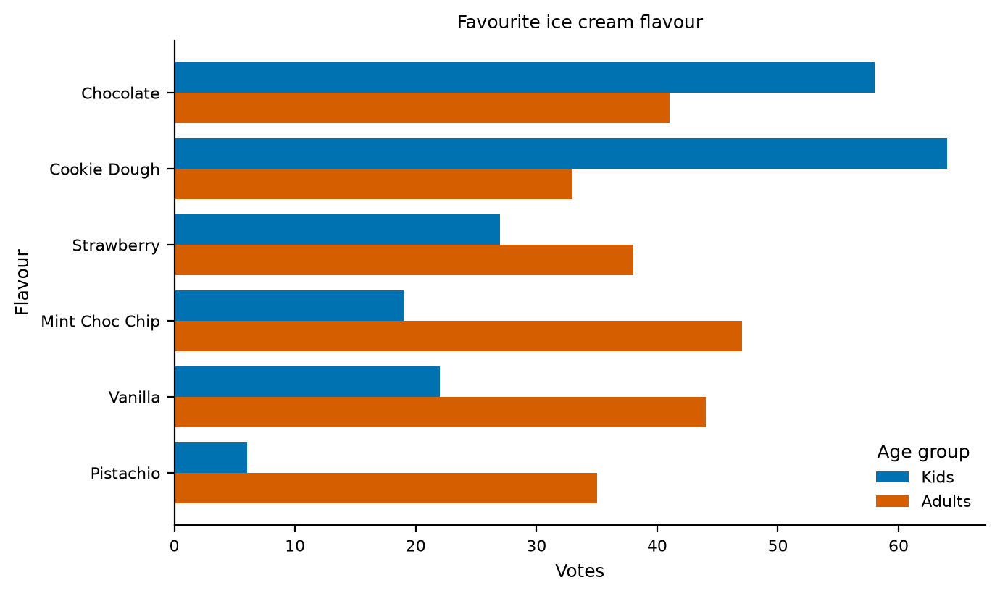

*First pass with the translation tool with JSON*

Nothing in the spec sets a colour, a line width, or a font size. The generator picks those, which is
how two figures in one paper end up agreeing with each other.

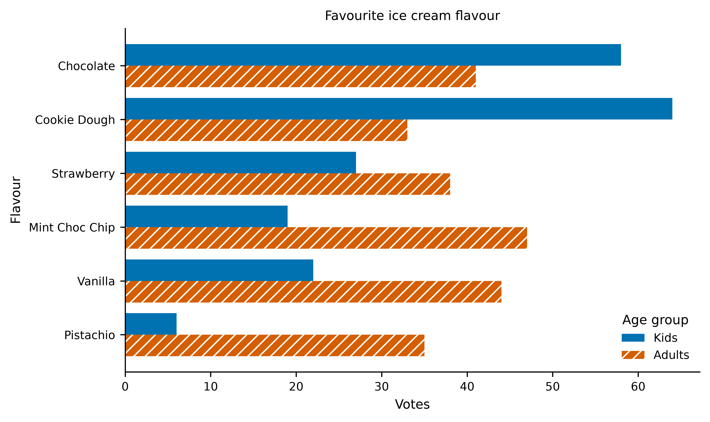

*Same JSON, after the improvements*

Adults is hatched now. The spec did not change, the tool did.

| First pass | After |
| --- | --- |
| 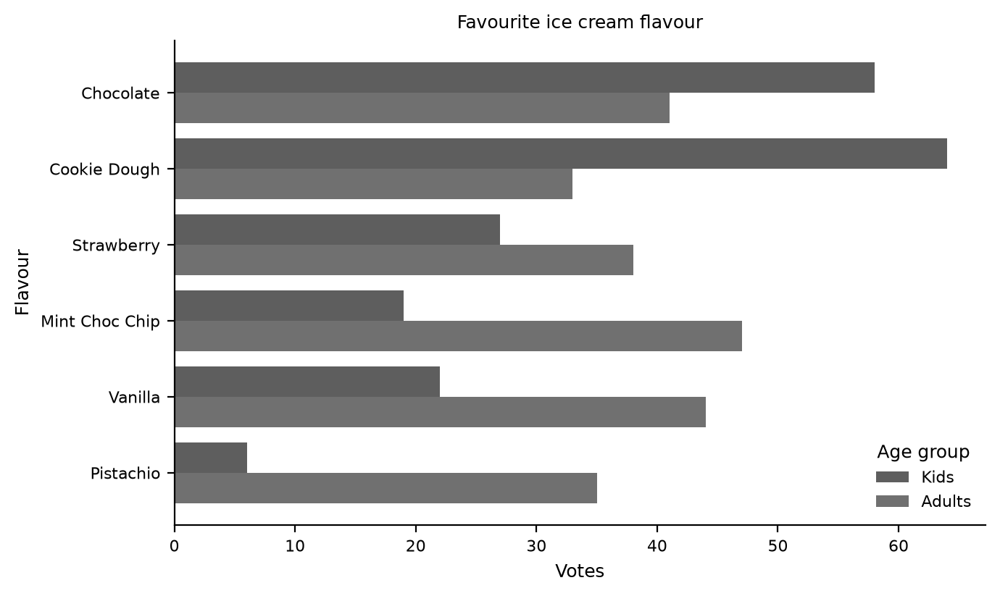 | 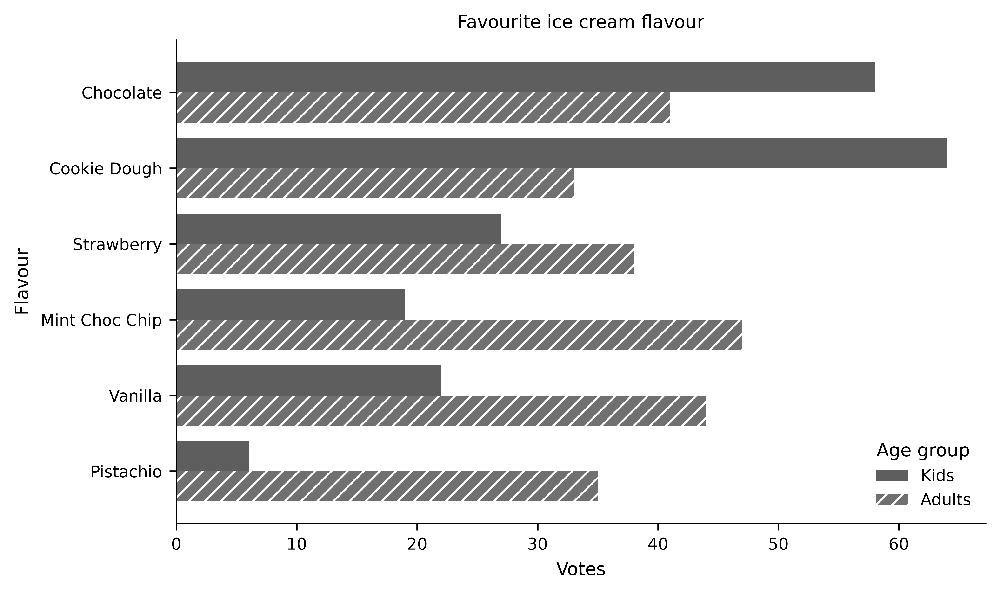 |

*Both of them printed in black and white*

This is why the hatching is there. Okabe-Ito is colourblind-safe but not greyscale-safe, so blue and
vermillion land 0.07 apart in relative luminance, under the 0.10 a reader needs. Reordering the
palette does not save it. Of all 40,320 orderings the best still leaves four series 0.094 apart.
Hatching does save it, at any number of series.

Fourteen kinds: line, scatter, bar, box, violin, ecdf, raincloud, ridgeline, forest,
paired difference, slope, dumbbell, heatmap and table. Panels, layers, insets and cut
axes compose them. Venue presets set the column width and the font floor from the real submission
guides, so a figure is measured against the width it will actually be printed at.

Set `"temporal": true` on the x axis of a line or scatter and the column is read as dates, sorted,
and laid out in time. The other kinds put categories on x, so the linter rejects it there rather
than drawing something misleading.

## Third pass, the rest of the chart types

| | |
| --- | --- |
| 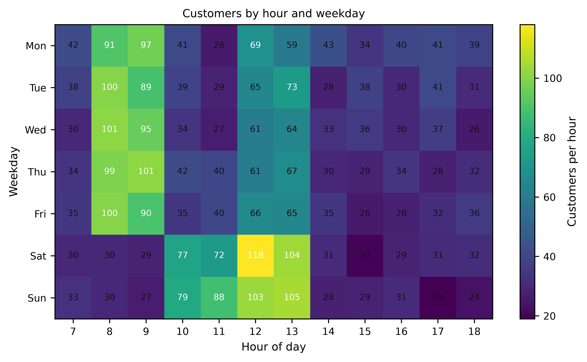 | 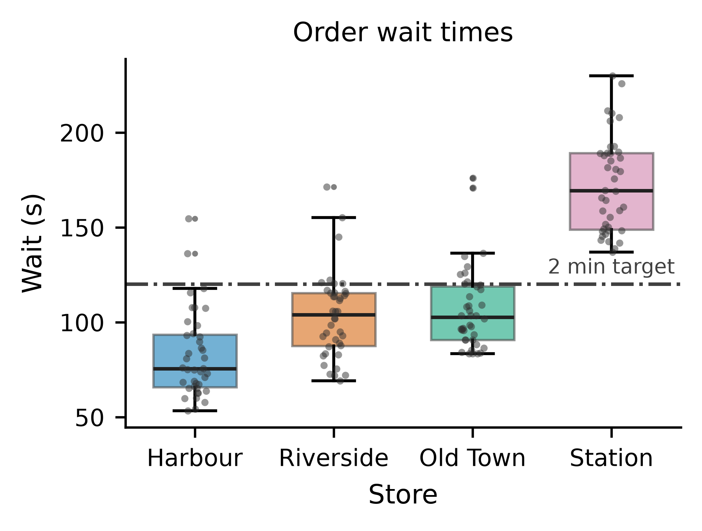 |
| 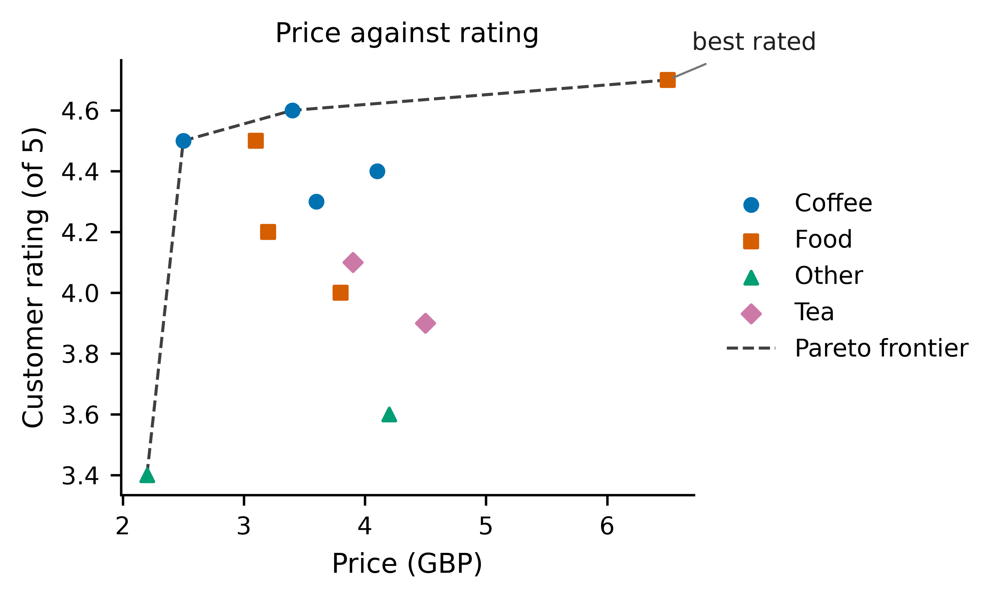 | 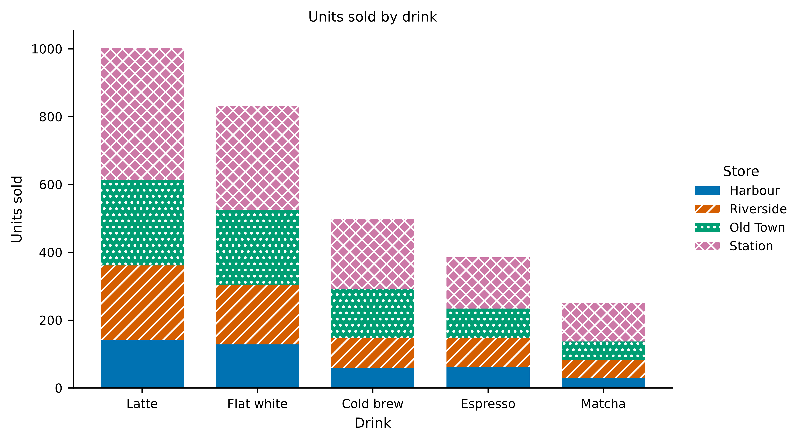 |
| 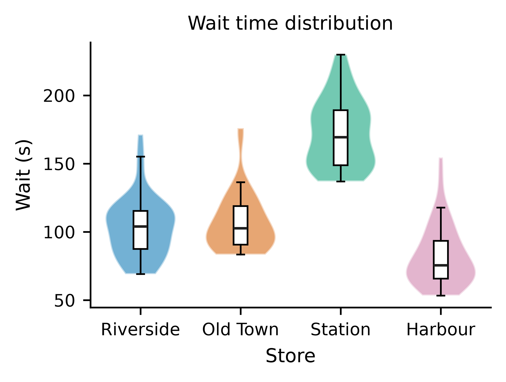 | 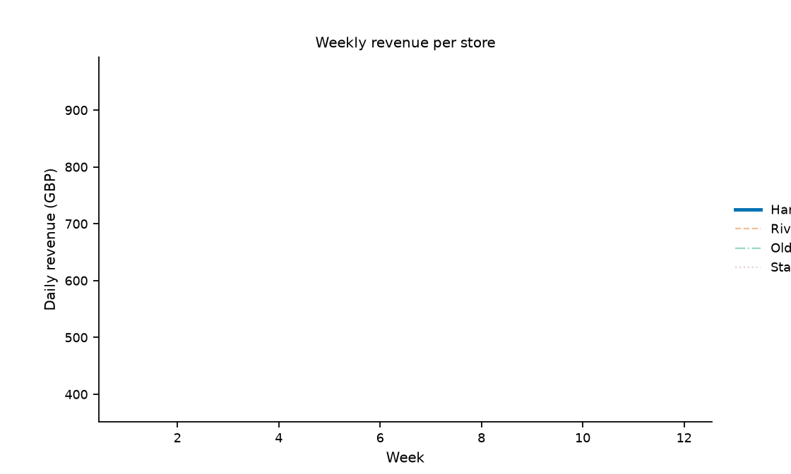 |

*Made-up coffee chain data, one chart per kind*

The data is invented, but each chart answers a real question rather than demonstrating a feature.

The heatmap finds the weekday commuter spike at 8am and the weekend brunch block without being told
either exists. The box plot carries a target line that says `"meaning": "target"` and lets the
generator decide how a target looks. The violin beside it shows the whole distribution where the box
shows five numbers. The last one is the same figure as a gif, because `animate` is a field rather
than a separate tool.

Building these found two bugs, and neither had shown up across thirty earlier figures. A scatter's
legend handle is a `PathCollection`, which has no marker to read, so four genuinely distinct marker
shapes all looked identical and the greyscale check complained about a problem the emitter had
already solved. And a colourbar is an axes, so every heatmap looked like two panels disagreeing
about their ranges.

The third finding was mine, not the tool's. It told me the legend was sitting on three data points
and suggested moving it outside, so I did.

## Fourth pass, most of it switched on at once

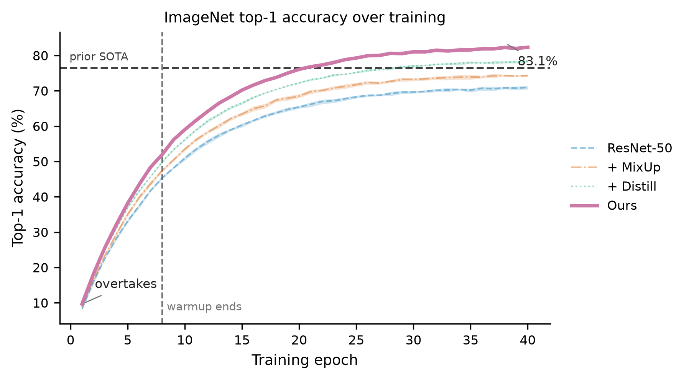

*Every feature that fits on one figure*

Four methods, mean of five seeds with 95% bootstrap intervals, two reference lines that state what
they mean rather than how they look, and two annotations placed at `"crossover"` and `"max"` instead
of at coordinates. NeurIPS column width, and a dash pattern per series so it survives a black and
white print. The spec names no colour and no position.

```json
{
  "kind": "line",
  "x": { "field": "epoch", "label": "Training epoch" },
  "y": { "field": "accuracy", "label": "Top-1 accuracy", "unit": "%" },
  "group": "method",
  "aggregation": "mean",
  "uncertainty": { "kind": "ci", "level": 0.95, "over": "seed", "display": "band" },
  "series_order": ["ResNet-50", "+ MixUp", "+ Distill", "Ours"],
  "emphasis": { "series": "Ours" },
  "reference_lines": [
    { "axis": "y", "value": 76.5, "meaning": "human", "label": "prior SOTA" },
    { "axis": "x", "value": 8, "meaning": "threshold", "label": "warmup ends" }
  ],
  "annotate": [
    { "at": "crossover", "series": "Ours", "text": "overtakes" },
    { "at": "max", "series": "Ours", "text": "83.1%" }
  ],
  "style": { "venue": "neurips" }
}
```

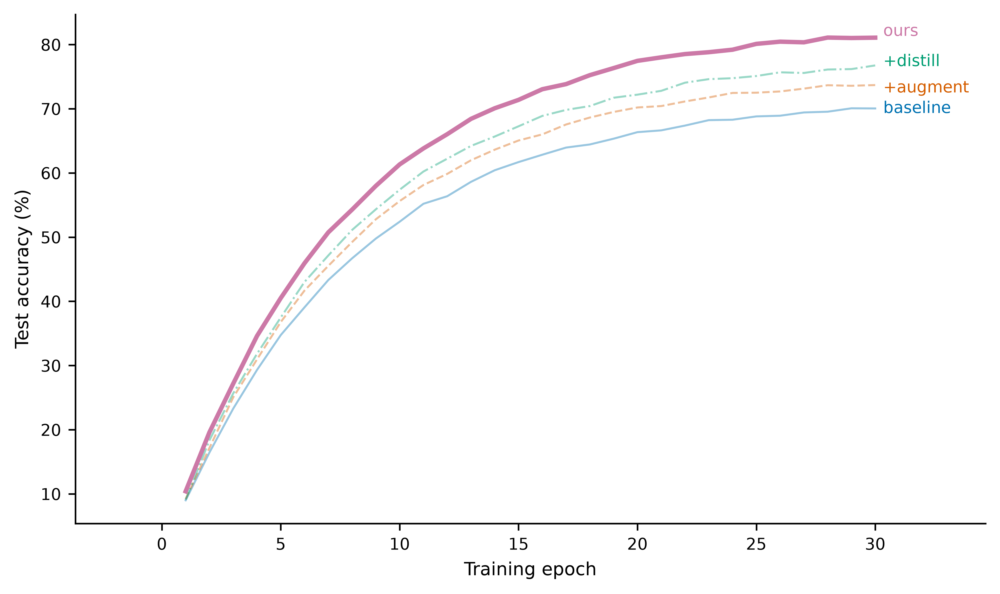

*Direct labelling, which sidesteps the legend entirely*

A legend box has to sit somewhere, and somewhere is usually on top of the data. Setting
`legend.style` to `direct` puts each name at the end of its own line.

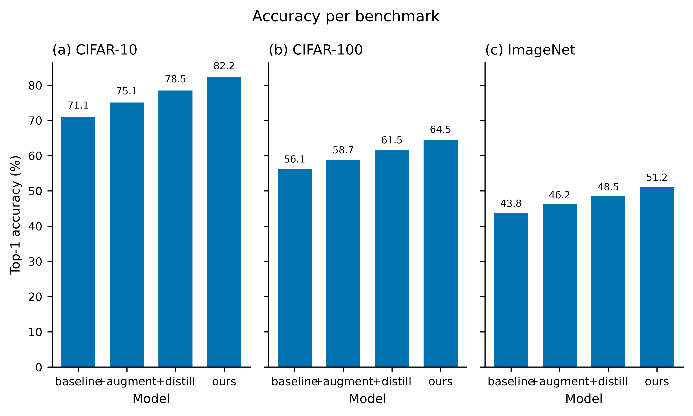

*Faceting, with one legend and axis labels only on the outer panels*

`facet` splits the data into one panel per value. The panels share their axes so a reader can
compare them, the legend appears once, and only the outer panels carry axis labels.

### The part you cannot see

A figure can now carry the claim it makes, and the script tests it against the data. The integrity
work names this failure exactly, a caption asserting a gain the figure does not show, and notes that
looking at pixels cannot catch it because the checker cannot read the manuscript.

```json
"claims": [
  { "kind": "beats_everywhere", "subject": "ours", "reference": "baseline" },
  { "kind": "gap_widens", "subject": "ours", "reference": "baseline" }
]
```

Run against data where the baseline leads early, that prints:

```text
claims:
  FAILS     ours is above baseline at every x (12 of 20 x values are not above baseline)
            the figure does not support this. Do not write it in the caption.
  HOLDS     ours pulls further ahead of baseline as x grows (gap moves from -5.2 to +3.8)
```

Alt text writes itself, which several journals now require. Levels one to three of the accessibility
model are derivable, so the spec supplies the encoding and the script supplies the numbers and the
trend. Level four is left to you rather than invented, because guessing at why a result matters is
the fabrication this tool exists to avoid. Only claims that held get quoted.

Each figure also writes a `.tex` block at the right column width, an optional interactive HTML
version through plotly, and a hash of the data file so a stale figure can say so.

### One appearance per series, across a whole paper

| Figure 1 | Figure 7 |
| --- | --- |
| 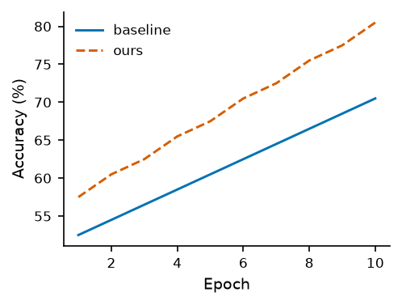 | 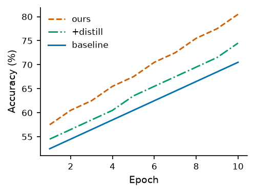 |

*The second figure lists the series in a different order and adds a third*

`series_order` fixed colour inside one spec while figure 1 and figure 7 were free to disagree. Point
`palette_lock` at a shared file and the first figure to mention a series claims an appearance for
it. Adding a method later does not recolour the ones already in the paper.

## Fifth pass, composition and a library on top

| | |
| --- | --- |
| 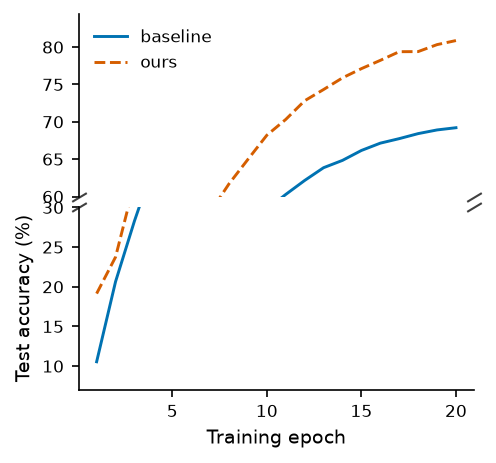 | 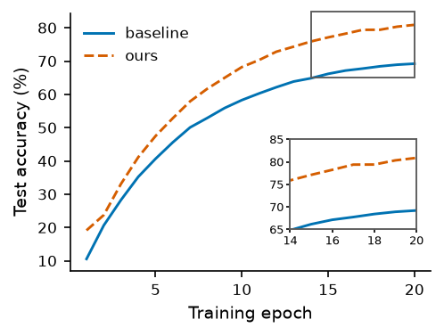 |

*A cut axis and a zoomed inset*

The slanted marks at the join are the point of a cut axis. Without them a reader takes the axis for
continuous and misreads every distance across the gap, which is the failure the truncation
literature is about. The inset marks its source region with a matching outline rather than connector
lines, because connectors on a flat chart read as a perspective box.

Vega-Lite's operators compose recursively, which is more than this needs. What recurs in a paper is
a short flat list, so that is what the spec takes.

```json
{
  "layers": [{ "mark": "scatter", "label": "observations" }, { "mark": "rug" }],
  "repeat": { "fields": ["accuracy", "loss", "latency_ms"], "columns": 3 },
  "axis_break": { "axis": "y", "from": 30, "to": 60 },
  "inset": { "x": [14, 20], "y": [65, 85], "corner": "lower_right" }
}
```

| | |
| --- | --- |
| 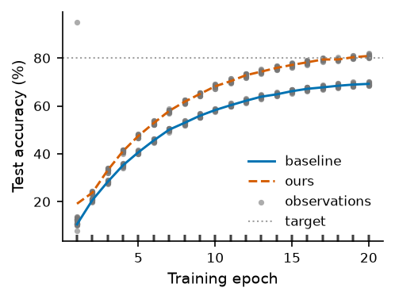 | 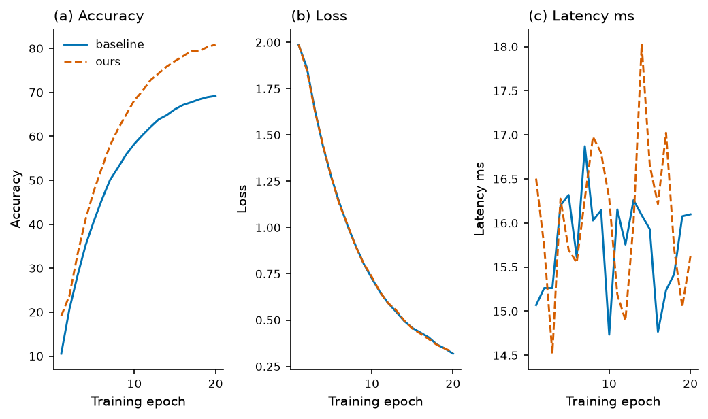 |

*Layers over the same axes, and one panel per metric*

A layer adds a mark over the figure's own x, so observations can sit over a fitted line and a rug
can show where the data actually falls. `repeat` gives one panel per named column, and each panel
takes its own label rather than the spec's.

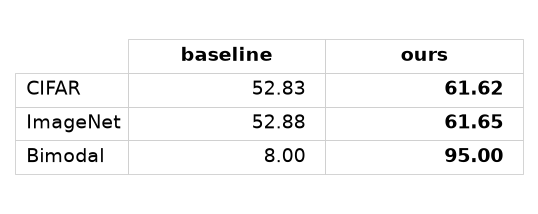

*The table kind, rendered as an image and written as markdown and LaTeX*

There is a `table` kind now, because sometimes six numbers should not be a chart. A printed number
is exact rather than estimated, so it outranks every graphical channel for reading one value. One
spec writes markdown, LaTeX and an image, so the readme, the manuscript and the slides cannot drift
apart, and `highlight` bolds the winner in each row or column.

### Writing specs in Python

The MCP tools are for an agent. `graphunslopify.Figure` is the same thing for a person in a
notebook.

```python
from graphunslopify import Figure

(
    Figure.line("results.csv")
    .x("epoch", "Training epoch")
    .y("accuracy", "Test accuracy", unit="%")
    .by("model", order=["baseline", "ours"], emphasise="ours")
    .average_over("seed")
    .claim("beats_everywhere", "ours", "baseline")
    .venue("neurips")
    .render()
)
```

`average_over` sets the aggregation and the spread together, because doing one without the other
throws away what a reader most needs. `render` posts the spec, writes the script beside the data and
runs it, so what lands on disk is the same script an agent would have got. Nothing here
reimplements the emitter, because two emitters drift. `Figure.from_profile` ranks candidates for a
file and starts from the best one, so there is no guessing at all.

## Writing a spec

Do not guess at the data. Ask it:

```bash
pip install ./python
graphunslopify describe results.csv
```

That reports the columns, their roles, how many distinct values each has, and whether x repeats per
series, along with a starting spec. On the example data it picks `epoch` over `seed` as the x axis
and adds the aggregation and confidence interval the repeats require.

Then hand that profile to `suggest_figures` and get candidates back, ranked by a weighted cost in
the shape Draco uses. The weights come from the Cleveland and McGill accuracy ranking, so a design
that reads by length scores worse than one that reads by position, and the suggestion quotes the
measured ratio rather than asserting a preference.

`apply_fixes` repairs a spec using its own findings. Every finding carries a machine-readable patch,
because the agent literature reports models recognising an error and failing to act on it, which is
an interface problem rather than a reasoning one. The loop has a budget so it says what it could not
fix instead of churning.

`list_recipes` has eighteen known-good specs to start from. `validate_spec` checks one without
generating anything, and `score_spec` costs one so two can be compared.

## Connecting

```bash
claude mcp add --transport http graph-unslopify https://json-translator-three.vercel.app/api/mcp
```

Your data never leaves your machine. You get back a script that reads your own CSV.

## Other output formats

Set `animate` and the same figure draws itself as a gif or an mp4.

```json
{ "animate": { "style": "draw", "duration_s": 4, "easing": "smooth", "format": "gif" } }
```

Set `output.interactive` and you also get a self-contained HTML figure through plotly, with hover
and zoom, which is what a project page wants and a paper does not. Set `output.latex` and you get an
`\includegraphics` block at the right column width with the caption and alt text already in it.

On manim, with evidence rather than an opinion. It does not install here, because `moderngl` and
`glcontext` fail to build wheels without a C toolchain. Even where it installs it draws its own axes
rather than the ones this spent so long getting right. What makes those animations read well is
easing and staged construction, and both are a few lines over `FuncAnimation`. The rate functions
are ports of manim's and keep its names, so `easing: "rush_into"` does what you would expect.

plotly and scipy do install, and both are used. scipy makes the t-test and Mann-Whitney options real
rather than a fallback to the bootstrap.

## What checks the work

Fifty-six rules run on the server against the spec alone. The Python package checks the rendered
figure, which is where the rest hide.

It measures every text element at the width the figure will be printed and fails below the venue's
floor. It compares label positions, so an annotation on the title or an inset crowding its parent
gets caught. It measures colour distance in CIELAB under three simulated colour vision deficiencies.
And it refuses a truncated bar axis outright, because a bar's length is its value.

`docs/research.md` maps every rule to the paper or policy behind it.
`docs/future.md` parks what is worth building next and says why none of it is
scheduled yet. `examples/README.md` covers the
gallery and why its images are committed.

## The gallery, rebuilt and measured

Fifteen figures, one per branch of the emitter. They used to be built by POSTing each spec to the
deployed API, which meant the committed images recorded whatever happened to be live rather than
what the code in the tree does. They had fallen a version behind without anyone noticing. Every
script in `examples/generated` claimed 0.5.0 while the emitter stamped 0.6.0. They are translated
locally now, and `npm run baseline -- --check` fails if the two ever separate again.

| | |
| --- | --- |
| 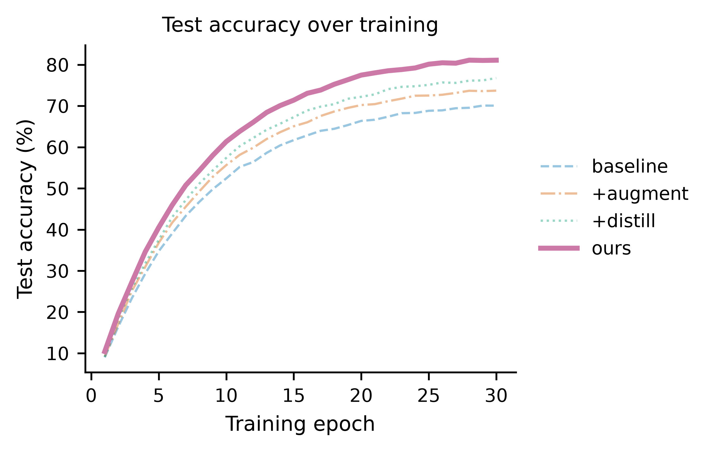 | 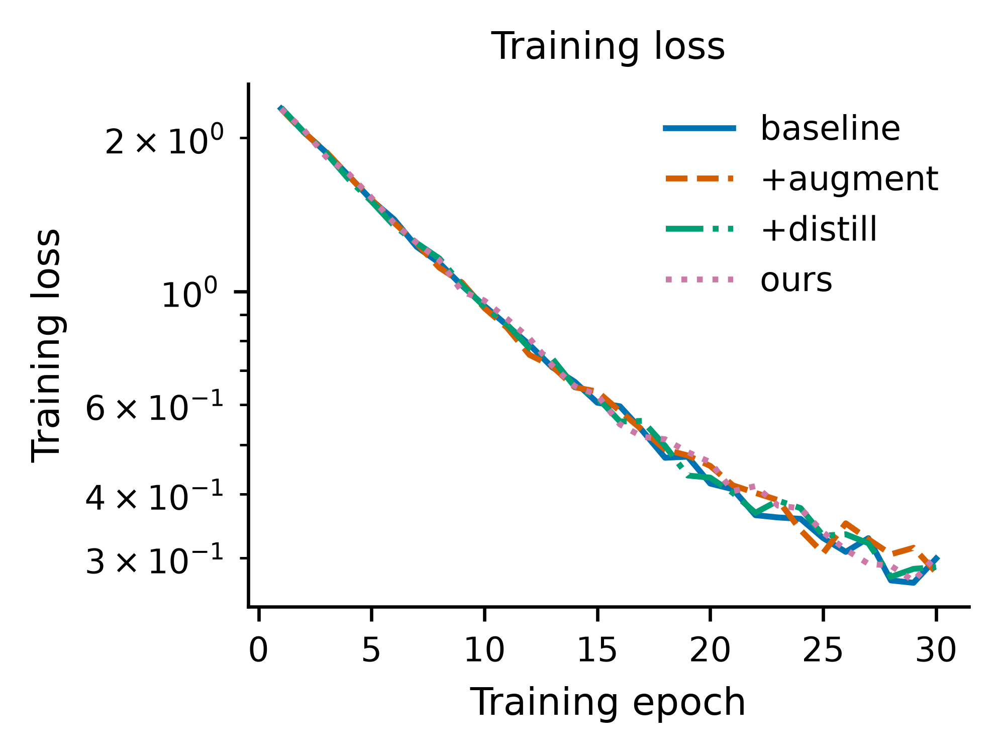 |
| `01-training-curve`, mean over seeds with the argued series in front | `02-loss-log`, log axis and median aggregation |
| 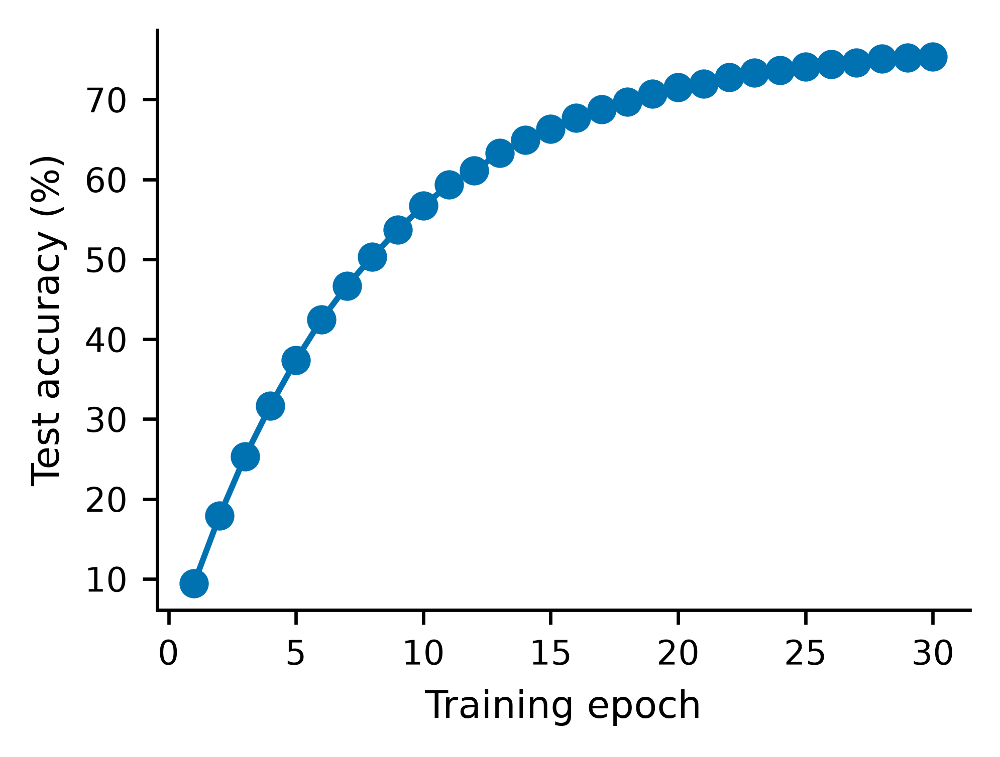 | 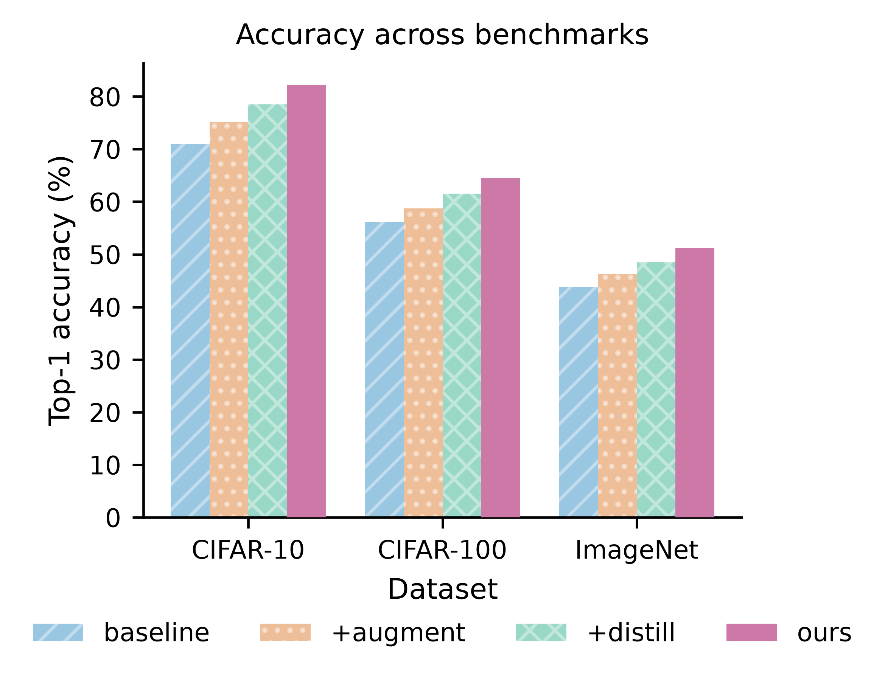 |
| `03-single-run`, no group, legend suppressed | `04-accuracy-by-dataset`, grouped bars with the legend below |
| 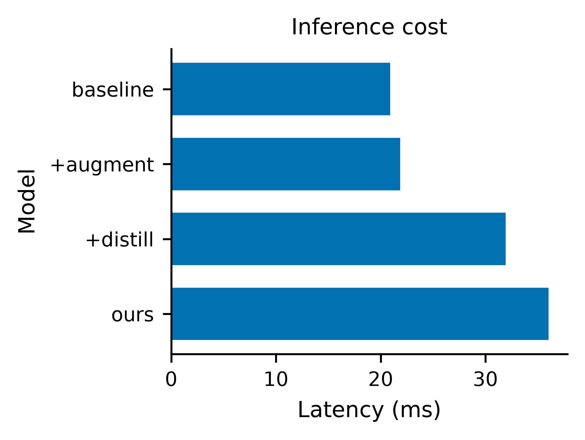 | 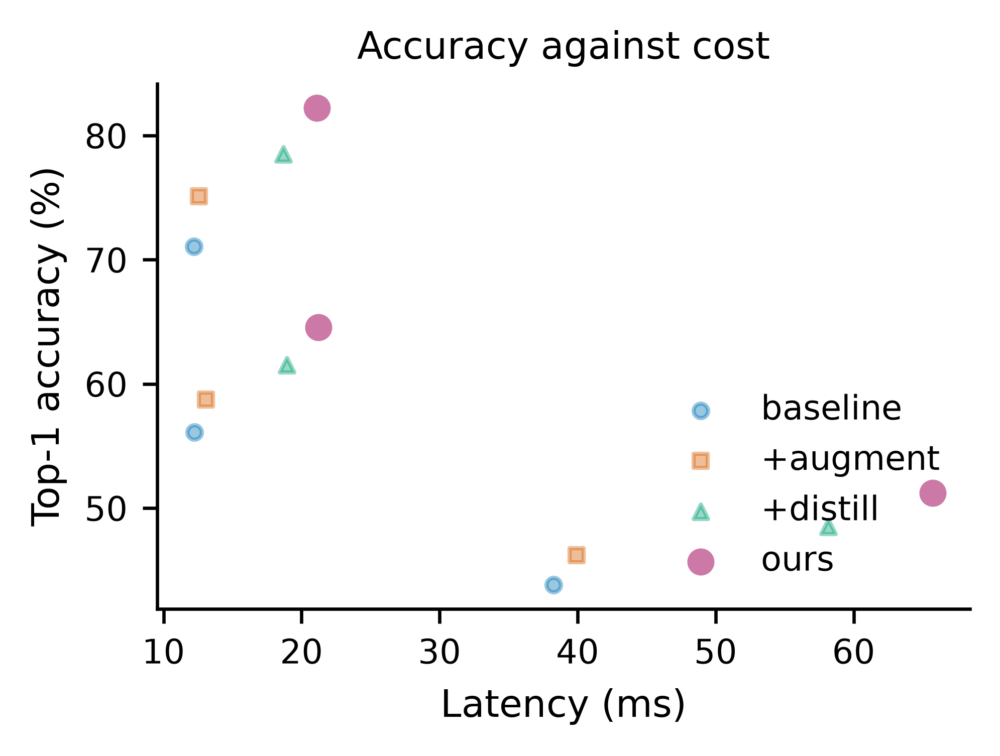 |
| `05-latency-ranking`, horizontal bars sorted by value | `06-accuracy-vs-latency`, one marker shape per series |
| 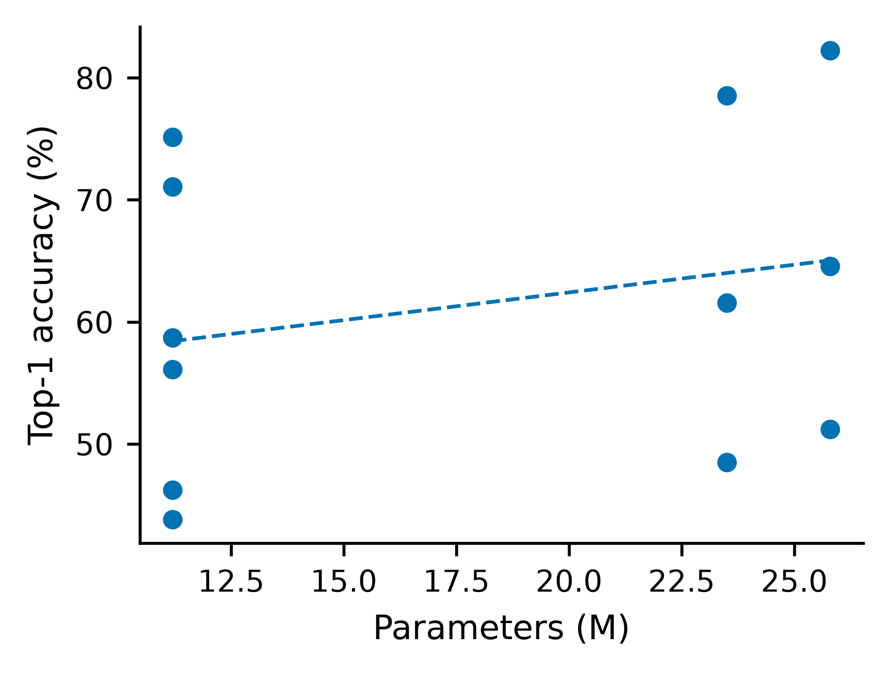 | 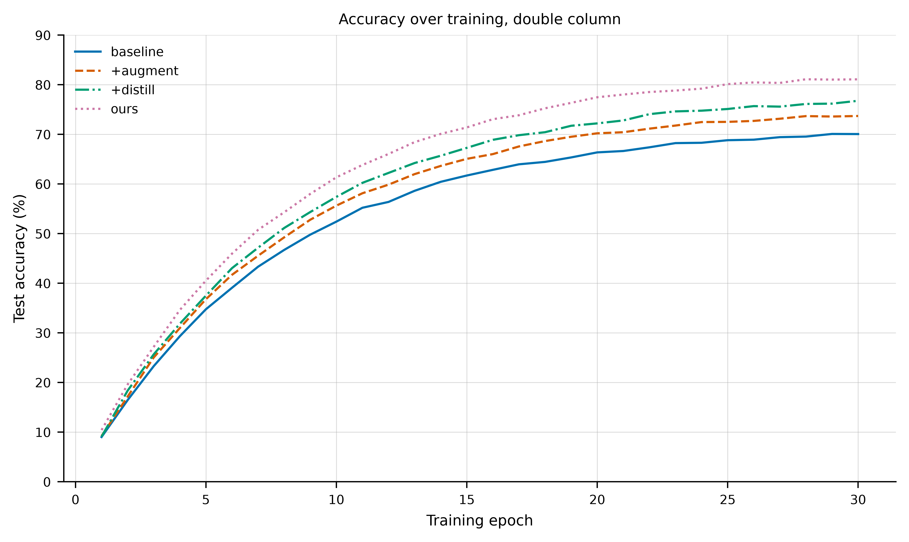 |
| `07-params-trendline`, linear fit on an ungrouped scatter | `08-compact-double-column`, compact preset at double width |
| 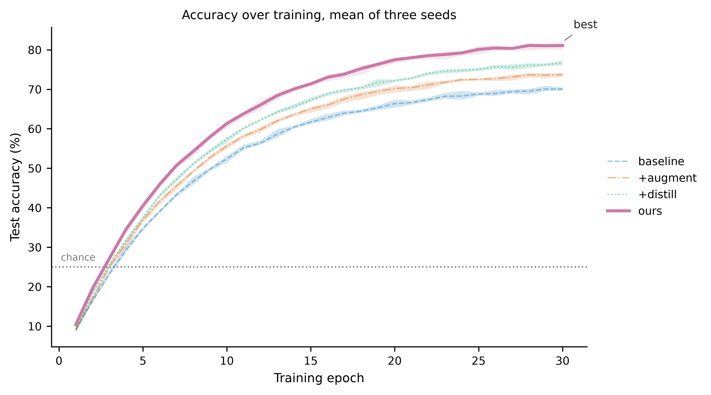 |  |
| `09-uncertainty-band`, bootstrap intervals and a labelled chance line | `10-faceted-benchmarks`, one panel per dataset |
| 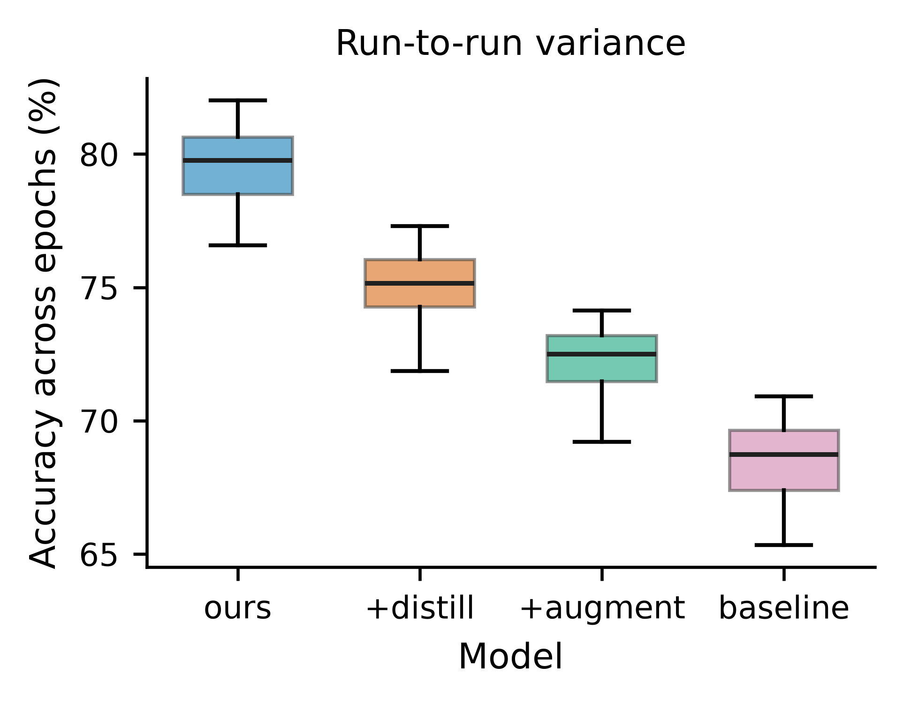 | 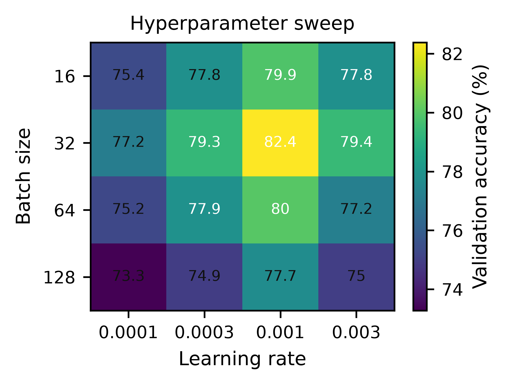 |
| `11-seed-spread`, distribution behind the summary | `12-sweep-heatmap`, annotated cells and a labelled colourbar |
| 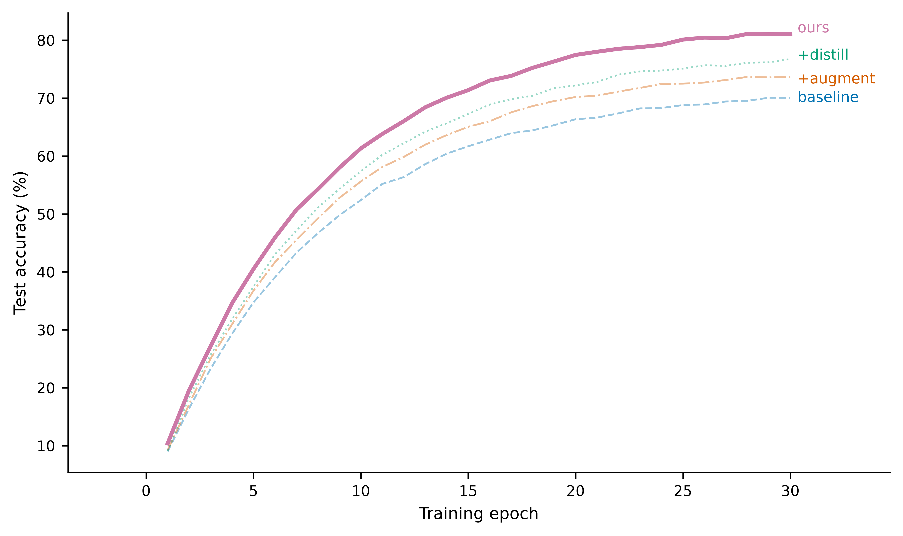 | 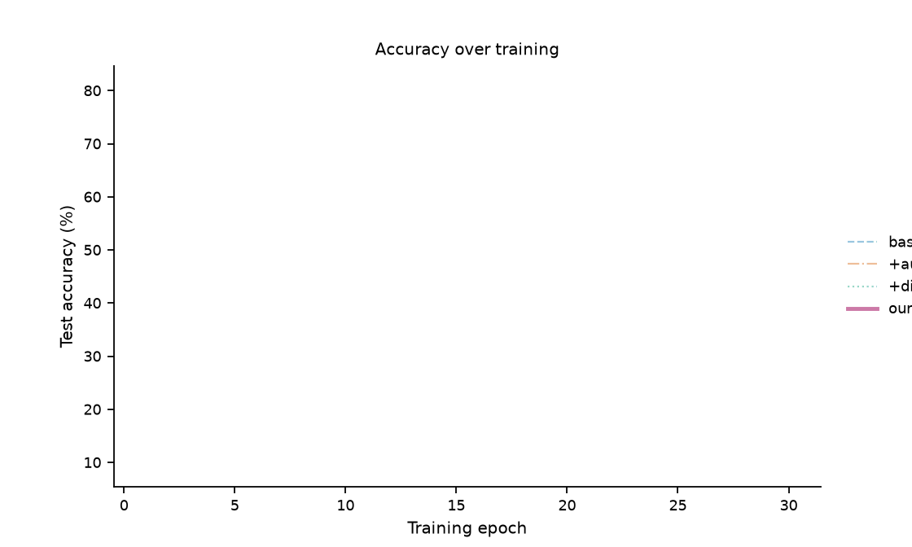 |
| `13-direct-labels`, names at the end of each line | `14-animated-curve`, the same figure as a gif |
| 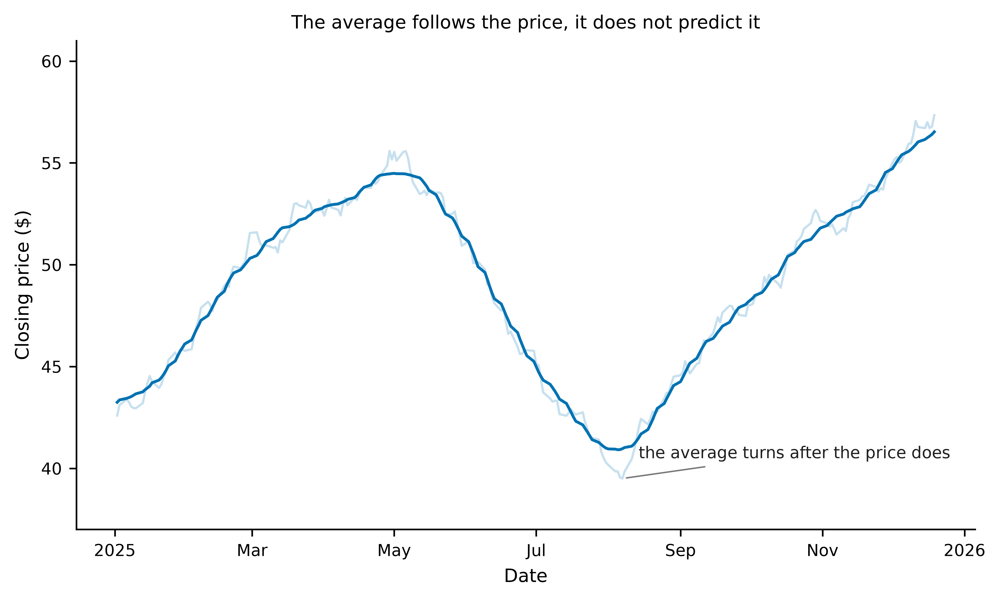 | |
| `15-price-and-average`, a temporal x axis | |

Each alt string above is a trimmed version of the one the script itself printed, numbers kept. The
full sentences are longer, and the scripts write them into the exported files.

### What the checker says about its own gallery

Running all fifteen through the render-time checker in `python/graphunslopify` found three problems.
One of them was the checker's own fault.

It reported `02-loss-log` drawing a minus sign on top of a log-axis tick label. That tick was never
drawn. Matplotlib lays ticks on a round grid and keeps the ones past the view limits, and those
report themselves as visible and carry a real bounding box, so the collision checks were measuring
labels no reader can see. The checker now skips them, and `02-loss-log` is clean.

Thirteen of the fifteen come back clean. The two that do not are real, and both are visible in the
images above. `06-accuracy-vs-latency` puts the legend over two data points at roughly 49ms and 66ms.
`10-faceted-benchmarks` overlaps "baseline" and "+augment" on the x axis of all three panels. Neither
is new, and rendering the scripts committed before this change reproduces both. Fixing those two
specs belongs in its own change rather than a quiet edit here.

One figure got better on its own. `06-accuracy-vs-latency` reported four findings before and reports
one now. The two that went away are `greyscale_collision` and `series_indistinguishable`. The emitter
had already learned to fix both by giving each series its own marker shape, and the gallery had
simply never picked the fix up, because it was still being built from a deployment that predated it.

## Sixth pass, what one stock chart broke

Someone asked for a share price against its 20-day moving average. It is the most ordinary chart in
finance and the tool had three bugs and one gap sitting in the way of it.

### apply_fixes turned a year of prices into 252 bars

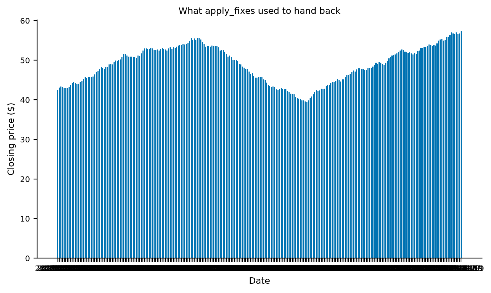

*What `apply_fixes` handed back for a daily price series*

The `line_implies_continuity` suggestion hedges properly. It says a bar chart makes the same
comparison **if** x is a set of unordered categories. Its patch did not hedge, so `apply_fixes` fired
`{ kind: "bar", aggregation: "mean" }` at every ungrouped line chart it saw, ordered x or not.

The spec carries column names and no column types, so nothing in it can tell a trading day from a
category. There is no clever fix here, only a wrong one, so the suggestion now carries no patch and
stays advice. A test sweeps every rule across every kind and fails if any fix payload touches `kind`,
because rewriting the kind of chart is the most destructive edit an auto-fixer can make.

### The checker measured labels that were never drawn

Setting `ylim` to `(28, 57)` produced a collision against a tick reading "60". There is no 60 on the
figure. Matplotlib lays ticks on a round grid and keeps the ones past the view limits, and those
report themselves as visible and carry a real bounding box:

```
view limits: (28.0, 57.0)
  tick '25'  data-y=25.0  visible=True  inside-view=False
  tick '60'  data-y=60.0  visible=True  inside-view=False
```

Every check that measures text was counting them. This is also the `02-loss-log` finding this readme
described two sections ago, where a minus sign supposedly collided with a log-axis tick. That figure
is clean now, and thirteen of the fifteen pass rather than twelve of fourteen. Chasing a phantom
label through three sets of axis limits before probing matplotlib directly is the most time any
single bug here has cost me.

### A date column had no axis to go on

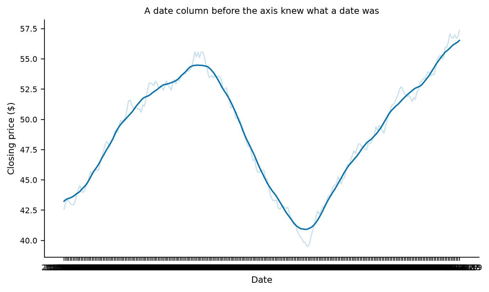

*A date column before `temporal` existed*

Dates arrived as strings, so matplotlib treated 252 of them as 252 categories. The curve above is
correct and the axis under it is unreadable.

`"temporal": true` on the x axis of a line or scatter now parses the column, sorts by it, and hands
the axis to `ConciseDateFormatter`. Sorting is not decoration. A date export in reverse order draws
the line backwards, and unlike a numeric x nobody notices until they read the ticks. Four rules bound
it, because only x can be temporal, only a line or scatter can carry it, time is not logarithmic, and
numeric limits cannot bound a date axis.

Then annotating one crashed:

```
TypeError: float() argument must be a string or a real number, not 'Timestamp'
```

`locate()` guarded with `np.isreal`, which asks whether a value is not complex. A Timestamp is not
complex, so it passed a test meant to mean "is a plain number" and reached `float()`. Three call
sites shared that mistake and now share one `as_coordinate` helper instead.


*`examples/specs/15-price-and-average.json`, the chart that started it*

The faint line is the daily close and the bold line is the 20-day average. The average turns after
the price does at both the May peak and the August trough, which is the whole point. A moving average
describes what already happened. The data is simulated, and the alt text says so.

The typecheck passed and every test passed before I rendered that figure for the first time. The
`Timestamp` crash was waiting on the other side of a green suite, which is the argument for the
gallery in one sentence.
